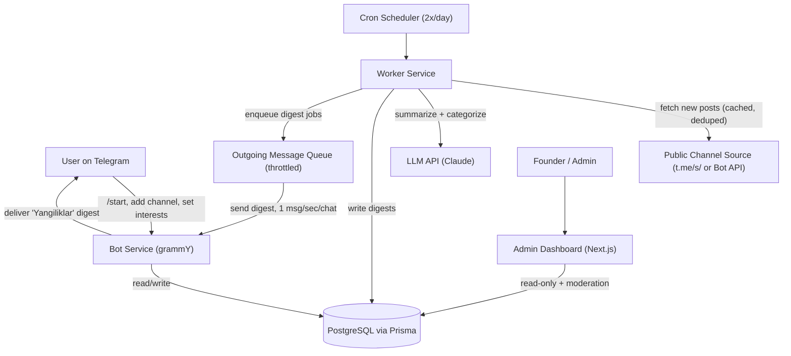

# System Architecture & Technical Specifications

> **Project**: Telegram Trend & Pain-Point Radar (`elak-radar`)  
> **Status**: Production-Ready Monorepo  
> **Package Management & Orchestration**: Turborepo + pnpm Workspaces

---

## 1. Executive Overview

**Telegram Trend & Pain-Point Radar** is an enterprise-grade Telegram SaaS product engineered to solve channel information overload. Instead of requiring users to scroll through hundreds of posts across 10–20 niche channels daily, the system curates, deduplicates, summarizes, and delivers personalized digests **exactly twice a day** (morning and evening) in **Uzbek**, paired with direct links back to original sources (`Batafsil: [link]`).

---

## 2. System Architecture Diagram



---

## 3. Monorepo Topology

```text
telegram-radar/
├── apps/
│   ├── bot/                  # Telegram bot service (grammY, onboarding, commands, delivery)
│   ├── worker/               # Scraper, LLM pipeline, digest builder, throttled queue, scheduler
│   └── admin/                # Founder & admin dashboard (Next.js 15 App Router, Tailwind CSS)
├── packages/
│   ├── database/             # Prisma schema, migrations, seed scripts, singleton client
│   └── shared-types/         # Domain DTOs, interfaces, and shared types
├── turbo.json                # Turborepo task pipeline configuration
├── pnpm-workspace.yaml       # pnpm monorepo workspace definition
└── package.json              # Monorepo root scripts & dev dependencies
```

---

## 4. Component Deep Dive

### 4.1 `packages/database` (Data Layer)

- **Engine**: PostgreSQL with Prisma ORM.
- **Relational Integrity**:
  - `User`: Stores `telegramId` (`BigInt` unique), active status, and custom digest schedule.
  - `Interest`: Curated categories in Uzbek (_Texnologiya, Startap, Karyera, AI, Biznes, Ta'lim, Dasturlash, Kripto & Moliya, Marketing_).
  - `UserInterest`: Many-to-many relationship between users and topics.
  - `Channel`: Tracks unique public channels, channel title, `isReachable` flag, and `lastScrapedAt` timestamp.
  - `UserChannel`: Tracks which users subscribe to which channels (capped at 15 per user).
  - `Post`: Stores raw post text, Telegram message ID, fetched timestamp, plus the LLM-generated Uzbek summary and category.
  - `Digest`: Comprehensive delivery audit trail with statuses (`sent`, `skipped_no_updates`, `failed`).
- **BigInt Serialization**: Provides `serializeBigInt` utility to prevent JSON serialization errors across Server Components and APIs.

### 4.2 `apps/worker` (Ingestion, Intelligence & Delivery Engine)

- **Channel Source Abstraction (`ChannelSource`)**:
  - `PublicPreviewChannelSource`: Fetches `https://t.me/s/{channel}` using Cheerio with strict rate limits (min. 1.5s between requests) and an in-memory cache (30-minute TTL).
  - `BotApiChannelSource`: Connects to official Telegram Bot API (`getChat`) for official reachability and metadata validation.
  - `CompositeChannelSource`: Primary fallback chain prioritizing public preview content with Bot API validation fallback.
- **Deduplication Engine (`ChannelFetcherService`)**:
  - Deduplicates tracked channels across all subscribers. If 1,000 users follow the same channel, that channel is fetched **only once** per cycle.
  - Compares post IDs (`channelId` + `telegramMsgId`) to insert only newly published posts.
- **Summarization Pipeline (`PostSummarizerService` & `apps/worker/src/llm/`)**:
  - `AnthropicLlmClient`: Connects to Claude 3.5 Haiku API with a strict Uzbek system prompt enforcing 1–2 sentence brevity and copyright-compliant paraphrasing.
  - `HeuristicLlmClient`: Resilient local fallback engine for offline execution and automated tests without API keys.
  - `parseLlmJsonResponse`: Extracts structured JSON even when markdown codeblocks are returned.
- **Digest Assembly (`DigestBuilderService`)**:
  - Respects the Section 5 template:
    ```text
    📰 Bugungi yangiliklar

    ▸ @kanalnomi
    [1-2 gapli xulosa, o'z so'zlar bilan]
    Batafsil: https://t.me/kanalnomi/12345
    ```
  - **Per-channel cap**: Maximum 3 top items per channel to keep reading time concise.
  - **Skip-if-no-updates**: Automatically omits channels and users with zero updates since the last digest.
  - **Telegram 4096 character chunking**: Automatically splits long digests into readable multi-part messages.
- **Throttled Delivery Queue (`ThrottledDeliveryQueue`)**:
  - Strict Telegram compliance:
    - Minimum 1000ms delay between consecutive messages to the same chat (`~1 msg/sec per chat`).
    - Minimum 35ms delay between consecutive global messages (`~30 msgs/sec globally`).
  - Automatically handles `403 Forbidden` (user blocked bot) by setting `user.isActive = false`.
  - Automatically handles `429 Too Many Requests` with exponential backoff and retry.
- **Cron Scheduler (`CronSchedulerService`)**:
  - Twice-daily automated cycle configured for 09:00 and 20:00 (Asia/Tashkent / UTC customizable).
  - Race condition prevention lock (`isCycleRunning`).
  - Critical failure alert dispatch to admin Telegram handle.

### 4.3 `apps/bot` (User-Facing Telegram Service)

- **Engine**: Node.js + TypeScript + `grammY`.
- **Language**: 100% natural, professional **Uzbek** interface copy.
- **Conversational Onboarding Flow**:
  1. `/start`: Warm greeting, value proposition, and user database upsert.
  2. **Interests Multi-Select**: Dynamic inline keyboard with checkmarks (`✅ Texnologiya`, `AI`) and a `Davom etish ➡️` action button.
  3. **Channel Input**: Accepts channel usernames (`@channel`), raw names, links, or forwarded posts. Instantly validates channel reachability and updates user subscriptions (max 15 channels).
  4. **Confirmation**: Summary of selected interests, tracked channels, schedule information, and ongoing command guidance.
- **Commands**:
  - `/mychannels` & `/removechannel`: Interactive channel list with one-tap delete buttons (`🗑`).
  - `/addchannel`: Prompt to add another public channel.
  - `/interests`: Re-open interest category preferences.
  - `/stop`: Two-step opt-out confirmation ensuring full Telegram compliance.
  - `/help`: Detailed command guide.

### 4.4 `apps/admin` (Founder Management Portal)

- **Engine**: Next.js 15 (App Router) + React 19 + Tailwind CSS + Lucide Icons.
- **Authentication**: Password-protected HTTP-only session cookie (`radar_admin_session`).
- **Dashboard (`/`)**:
  - High-level KPI cards: Total users, active subscribers, tracked channels, reachable status, digests sent today, delivery success rate.
  - **14-Day Growth Chart**: Interactive visual bar chart tracking daily new user registrations.
  - **Recent Dispatches**: Live audit table showing latest digest deliveries.
- **User Management (`/users`)**: Search by username/ID/interest, view subscriber preferences, and instant status toggling (deactivate / reactivate).
- **Channel Inventory (`/channels`)**: Scraped status, subscriber counts, cached post counts, reachability indicator, and direct Telegram links.
- **Delivery Audit Logs (`/digests`)**: Historical logs with post counts and dispatch timestamps.

---

## 5. Telegram Compliance Matrix

| Rule                                    | Implementation Guarantee                                                                                                                                |
| :-------------------------------------- | :------------------------------------------------------------------------------------------------------------------------------------------------------ |
| **No unauthorized scraping abuse**      | Official Telegram Bot API prioritized; public `t.me/s/` used only as lightweight, cached fallback with 30-min TTL and rate limiting.                    |
| **Deduplicated channel ingestion**      | Channels are fetched **once per cycle** globally, regardless of subscriber volume.                                                                      |
| **Strict rate limit adherence**         | `ThrottledDeliveryQueue` enforces ≥ 1s per chat (~1 msg/s) and ≥ 35ms global delay (~30 msg/s).                                                         |
| **No spam / Explicit opt-in & opt-out** | Users must initiate with `/start`. `/stop` immediately deactivates the user and halts all dispatches. Blocked bot events (`403`) auto-deactivate users. |
| **No full-content reposting**           | Content is paraphrased by LLM into 1–2 sentences in Uzbek + source link (`Batafsil: ...`), protecting copyright.                                        |
| **Data minimalism**                     | No user phone numbers or session credentials stored; only public usernames and Telegram IDs.                                                            |

---

## 6. Execution Modes

```bash
# 1. Run local development (all services)
pnpm dev

# 2. Run bot independently
pnpm --filter @radar/bot dev

# 3. Run worker on-demand single cycle
RUN_ONCE=true pnpm --filter @radar/worker dev

# 4. Run worker as persistent twice-daily scheduler
pnpm --filter @radar/worker dev

# 5. Run admin dashboard
pnpm --filter @radar/admin dev
```
